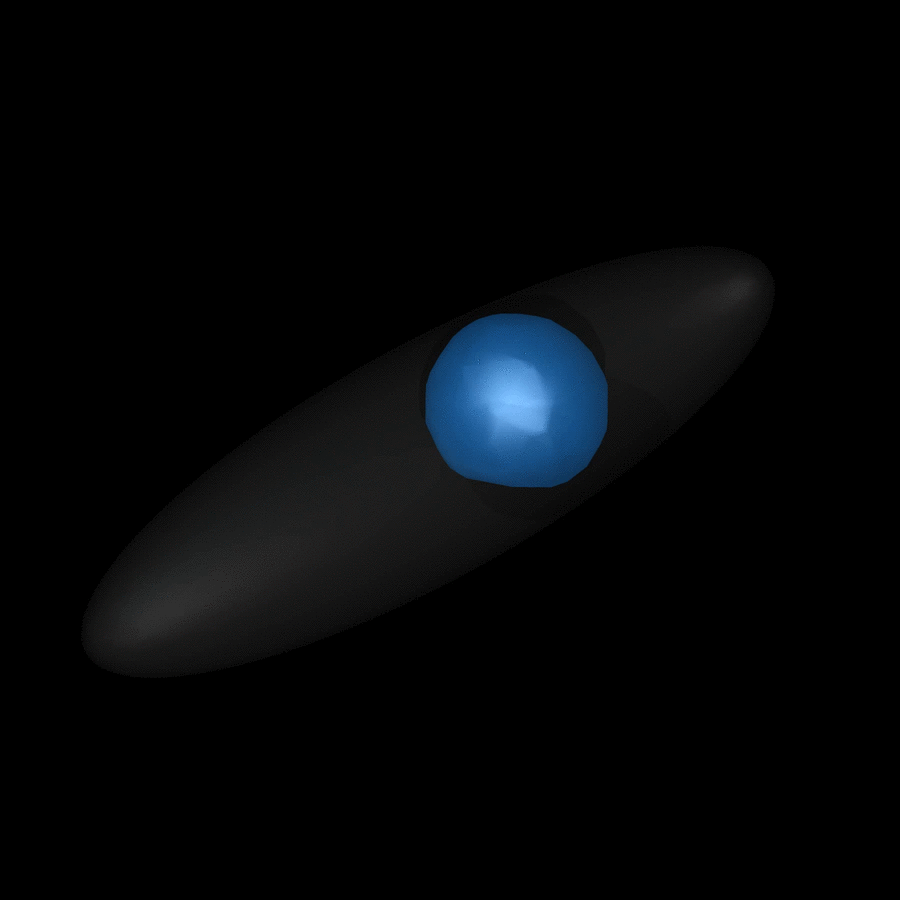
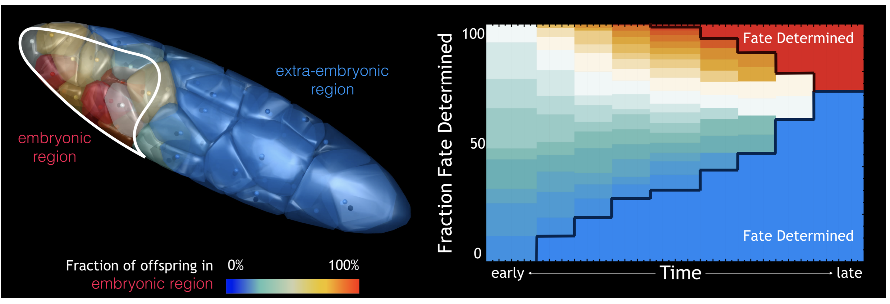

# Insect-Development-Model
Code by Jordan Hoffmann
Work by Seth Donoughe and Jordan Hoffmann
Done in the lab of Cassandra Extavour

_All code will be uploaded with the manuscript preprint. Feel fee to contact me if you have any questions._

Based on experimental data from a light-sheet microscope, I developed a model that recapitulates the observed motion of nuclei.

Below, we show a schematic representation of a computational method for simulating syncytial development. Nucleus movements are simulated in a 3D egg, but it is schematized here in 2D. 


The model is implemented in `Python.` By solving the Eikonal equation, <a href="https://www.codecogs.com/eqnedit.php?latex=F(\vec{x})&space;|&space;\nabla&space;T(\vec{x})&space;|&space;=&space;1" target="_blank"></a>. I do this using the `scikit-fmm` library. This approach naturally captures many aspects of development and results in a minimal number of free parameters, almost all of which can be directly extracted from the data. 

# Putting it Together
A single shell will move due to the asymmetry that is incorporated. As a result, the shell will pull the nucleus towards a wall.

Next, we need to allow for nuclei to divide. When they do so, their shells are oriented in opposite directions. We are able to extract the division rate from the data.

Lastly, we need nuclei to divide and move, allowing them to interact with one another and the boundary. With an arbitrarily chosen division rate, we get rapid expansion to naturally occur, due to steric effects, and as density increases nuclei slow down.

Lastly, we can tune individual parameters from the data to get something that appears more realistic.

# Geometry
We are able to deploy our model over a wide range of different geometries. Below, we show an example in a slightly bent embryo shape as well as an ellipsoidal shape.

Below, I show an ellipsoidal geometry. 

In the above two plots, the colors are random for the different nuclei.

Insect eggs adopt a very large space of shapes and sizes. Many eggs are curved into U shapes, have large asymmetries, and eggs range in volume by more than 8 orders of magnitude. An advantage of having an _in silico_ model is that by altering the geometry, we are able to ask what would happen if a model, tuned on one organism, where to operate in the egg of another. This allows us to make potential hypothesis and targeted experimental predictions.

In the above plot, the color represents the instantaneous speed of motion at the snapshot that is shown.

# Comparison to Experimental Data
By extract parameters from the data, we are able to match every quantifiable aspect of embryonic development that we are able to measure.
 
# Fate
In the development of _Gryllus bimaculatus_, only a small fraction of the entire egg volume comprises the region where the embryo will coalesce. By using our developmental model, we are able to perfectly track nuclei through time. This allows us to hypothesis answers related to fate determination of nuclei (whether they will become embryonic or extra embryonic). A rough example of the capabilities are shown below. 

For each nuclei, we compute which fraction of the nuclei end up in a preselected embryonic region, versus what fraction of nuclei end up in the extra-embryonic region.

# Rendering Code	
A few people have asked me for the code I used to render the images. I used `povray` which can be installed easily on Ubuntu. On Mac, it is easily installed with either MacPorts or Brew. At the moment, I added a random file I had. It is a bit messy, but feel free to modify it to suit your needs or contact me. 

The code is structured to render convex objects at the moment, but this is easily modified for any shape of `Polygon[]` objects. The `printvertex[vec_]` function will convert the vertices into `povray` format. The majority of the heavy lifting is this code, which structures a `mesh2` object.
```mathematica
triangles = Table[
   triangles[[j]][[1]]
   , {j, 1, Length[triangles]}];
Len = Length[triangles];
getnormals = Table[
   Table[
    {triangles[[k]][[j]], unitnormal[triangles[[k]]] // N}
    , {j, 1, 3}]
   , {k, 1, Length[triangles]}];
getnormals = Partition[Flatten[getnormals], 6];
getnormals = Table[
   Partition[getnormals[[j]], 3]
   , {j, 1, Length[getnormals]}];
corrds = getnormals[[All, 1]];
normals = getnormals[[All, 2]];
NORMALS = Table[
   Table[Mean[
      Extract[normals, Position[corrds, triangles[[j]][[i]]]]] + 
     0.0001 {RandomReal[{-1, 1}], RandomReal[{-1, 1}], 
       RandomReal[{-1, 1}]}, {i, 1, 3}]
   , {j, 1, Length[triangles]}];
sets = Partition[Range[3*Len] - 1, 3];
ps = Position[Abs[NORMALS], _?(# < 0.0001 &)];
Table[
  NORMALS[[ps[[j]][[1]], ps[[j]][[2]], ps[[j]][[3]]]] = 0;
  , {j, 1, Length[ps]}];
ps = Position[Abs[triangles], _?(# < 0.0001 &)];
Table[
  triangles[[ps[[j]][[1]], ps[[j]][[2]], ps[[j]][[3]]]] = 0;
  , {j, 1, Length[ps]}];
```
Where it takes in a list of triangles. The code below it just generates a `.pov` file in the proper format.