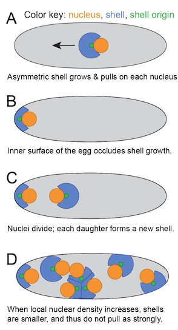
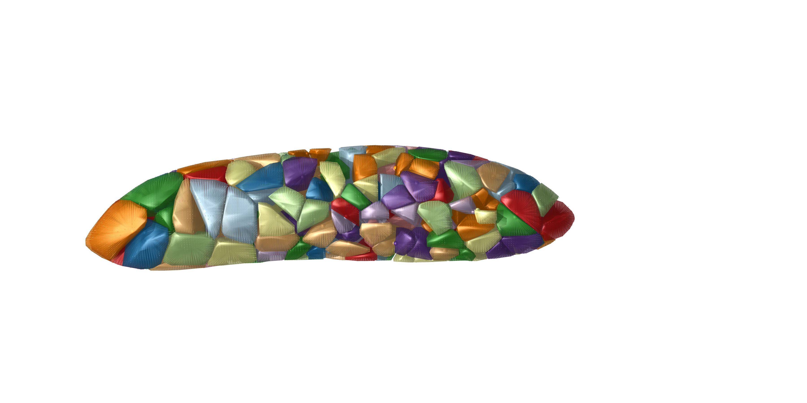
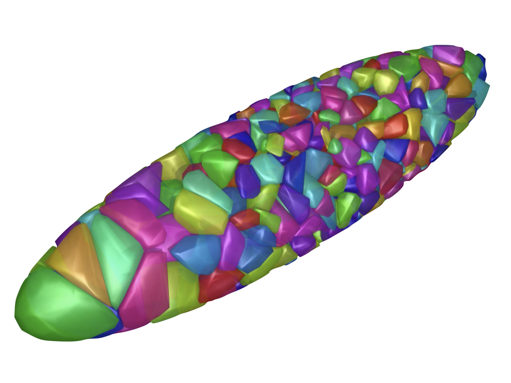
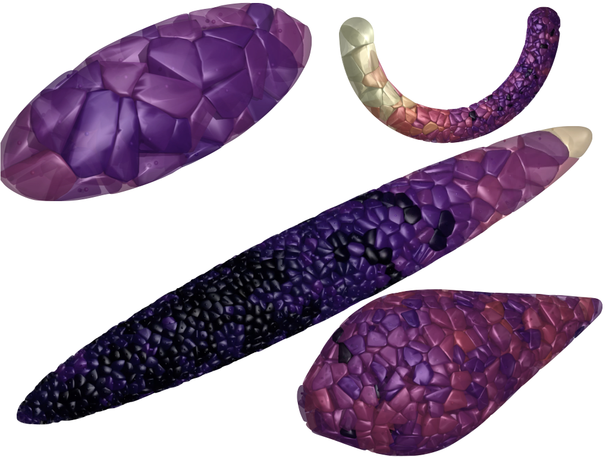

# Insect-Development-Model
Code by Jordan Hoffmann
Work by Seth Donoughe and Jordan Hoffmann

_All code will be uploaded with the manuscript preprint_

Based on experimental data from a light-sheet microscope, I developed a model that recapitulates the observed motion of nuclei.

Below, we show a schematic representation of a computational method for simulating syncytial development. Nucleus movements are simulated in a 3D egg, but it is schematized here in 2D. 

The model is implemented in `Python.` By solving the Eikonal equation, . I do this using the `scikit-fmm` library. This approach naturally captures many aspects of development and results in a minimal number of free parameters, almost all of which can be directly extracted from the data. 

# Geometry
We are able to deploy our model over a wide range of different geometries. Below, we show an example in a slightly bent embryo shape as well as an ellipsoidal shape.

Below, I show an ellipsoidal geometry. 

In the above two plots, the colors are random for the different nuclei.

Insect eggs adopt a very large space of shapes and sizes. Many eggs are curved into U shapes, have large asymmetries, and eggs range in volume by more than 8 orders of magnitude. An advantage of having an _in silico_ model is that by altering the geometry, we are able to ask what would happen if a model, tuned on one organism, where to operate in the egg of another. This allows us to make potential hypothesis and targeted experimental predictions.

In the above plot, the color represents the instantaneous speed of motion at the snapshot that is shown.